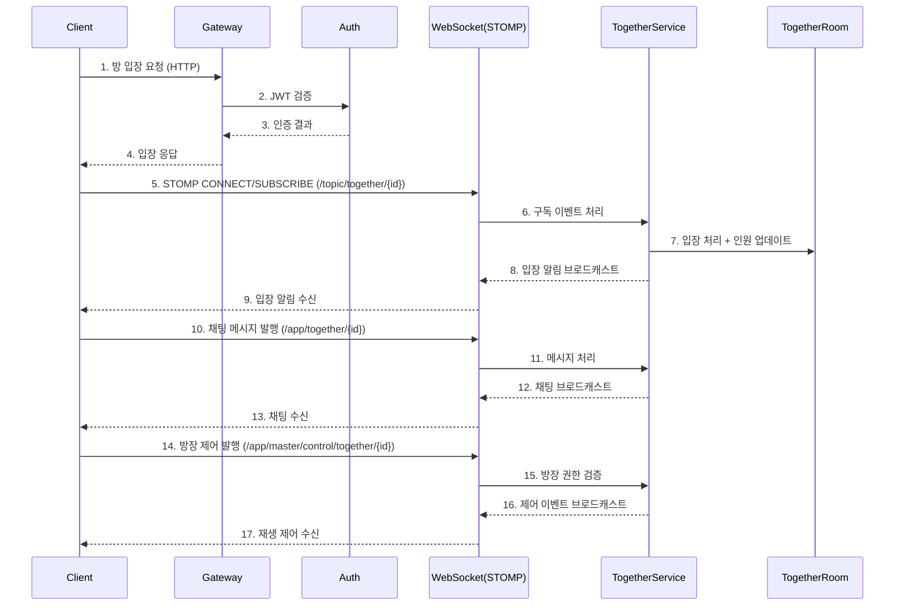
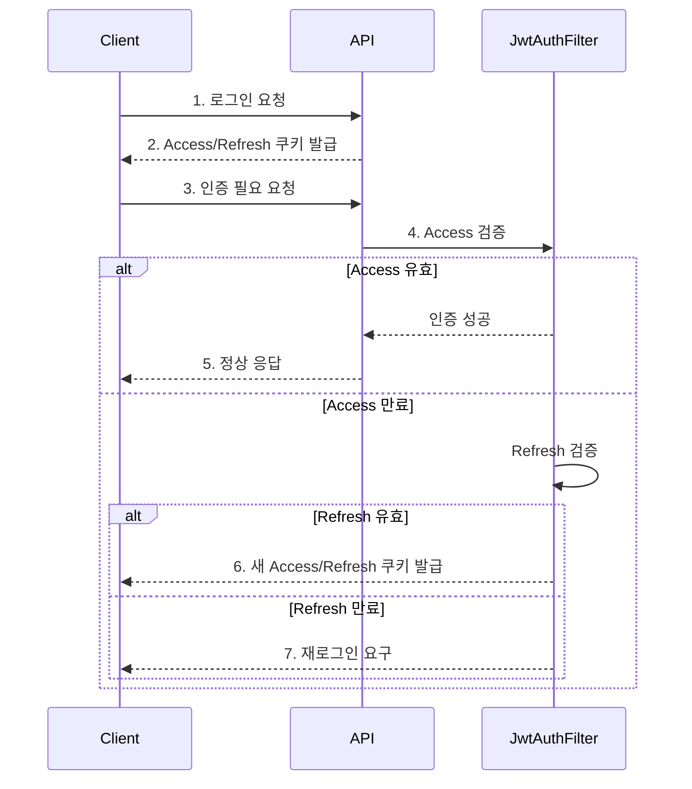

<h1 align="center">Dabom(FlowBox)  </h1>

 
 

프로젝트명 '다봄' 은 **'다'** 같이 **'본다'** 는 동시 시청의 핵심 기능과 새로운 디지털 공동체 문화가
**'봄'** 처럼 새롭게 시작된다는 의미를 동시에 담고 있습니다.

## 🫂 팀원 소개
<table align="center">
  <tbody>
    <tr>
      <td align="center"><a href="https://github.com/raccoon-coding"> <b> 팀원: 최민성</b></a> </td>
      <td align="center"><a href="https://github.com/tipsyboy"> <b> 팀원: 양형모</b></a> </td>
      <td align="center"><a href="https://github.com/flionme"> <b> 팀원 : 김성인</b></a> </td>
      <td align="center"><a href="https://github.com/Hanryang-Kim"> <b> 팀원 : 김륜환</b></a> </td>
      <td align="center"><a href="https://github.com/kbw07"> <b> 팀원 : 강병욱 </b></a> </td>
    </tr>
  </tbody>
</table>

---
# 🎬  Streaming Service

## 🎯 프로젝트 소개
**"혼자 보는 영상에서 함께하는 경험으로"**

비대면 소통이 일상화된 시대에, 단순한 영상 시청을 넘어 **실시간 공유와 소통이 가능한 스트리밍 서비스**를 개발하고자 합니다.
영상 콘텐츠와 실시간 채팅, 동시 시청 기능을 결합하여 새로운 형태의 디지털 공동체 경험을 제공하는 것이 저희의 목표입니다.

---
## 💚 Front-end
<a href="https://www.dabomvideo.kro.kr">프론트 주소</a>
##  📜소프트웨어 아키텍처
<a href="https://github.com/beyond-sw-camp/be17-3rd-FlowBox-DaBom/wiki/%EC%86%8C%ED%94%84%ED%8A%B8%EC%9B%A8%EC%96%B4-%EC%95%84%ED%82%A4%ED%85%8D%EC%B3%90">소프트웨어 아키텍쳐</a>

## 🔧시스템 아키텍처
<a href="https://github.com/beyond-sw-camp/be17-3rd-FlowBox-DaBom/wiki/%EC%8B%9C%EC%8A%A4%ED%85%9C-%EC%95%84%ED%82%A4%ED%85%8D%EC%B3%90">시스템 아키텍쳐</a>

## 📝 기능 명세서
<a href="https://api.dabomvideo.kro.kr/swagger-ui/index.html"> 기능 명세서 - Swagger-ui </a>

## 💡 성능 개선
<a href="https://github.com/beyond-sw-camp/be17-3rd-FlowBox-DaBom/wiki/%EC%84%B1%EB%8A%A5-%EA%B0%9C%EC%84%A0"> 테스트 및 성능 개선 </a>

---

### 핵심 기여 (담당 도메인 중심)
**인증/인가 (Member)**
- JWT + Refresh Token 구조로 전환해 세션 저장소 의존도를 제거
- **HTTP-Only Cookie** 저장 방식으로 보안 강화
- Access/Refresh가 함께 전달되는 특성을 활용해 **재발급 통신 단축**

**실시간 같이보기 (Together)**
- STOMP 기반 WebSocket에서 **채팅/제어 이벤트를 분리 구독**하도록 설계
- 방장 제어 이벤트가 모든 시청자에게 동기화되도록 처리

### 성과
- 인증/인가 플로우를 단순화해 **보안성과 효율성 동시 확보**
- N+1 개선 및 반정규화로 **응답 시간 약 20% 감소**
- 구독 분리로 **실시간 서비스 안정성** 강화

---
# 🌱 제가 담당한 핵심 개발 영역 (Backend)

## 1️⃣ Member 도메인
- 회원가입/로그인/로그아웃, 이메일·채널명 중복 체크
- JWT Access/Refresh 쿠키 기반 인증 및 재발급 플로우
- 채널 정보 조회/수정, 소프트 삭제 처리
- 프로필/배너 이미지 S3 URL 연동

### ✔ 해결한 문제
- 인증 상태 유지를 위해 **Stateless JWT + 쿠키 저장 방식** 도입
- 채널명 중복 방지 및 소프트 삭제 회원의 재가입 처리

---

## 2️⃣ Together(같이보기) 도메인
- 방 생성/검색/참여/삭제, 공개/비공개 + 참여 코드(UUID) 기반 입장
- 방장 권한 제어 (제목/영상/인원/공개 여부 변경)
- 참여자 관리 (입장/퇴장/강퇴, 인원 수 동기화)

### ✔ 해결한 문제
- 방장 권한에 따른 변경/강퇴 로직 분리로 **권한 검증 흐름 명확화**
- Together/TogetherJoinMember로 **참여 상태와 이력 분리**

---

## 3️⃣ WebSocket 실시간 채팅/동기화
- STOMP 기반 채팅 메시지 발행/구독
- 방장 재생 제어/영상 이동 이벤트 브로드캐스트
- 접속자 수 추적 및 입장 알림

---

## 🧩 Together 실시간 흐름 (시퀀스/아키텍처)
- STOMP 메시지 발행/구독 경로 및 이벤트 흐름 정리
- 방장 제어 이벤트와 일반 채팅 이벤트의 분리 구조 강조

---

## 🔐 Member 인증 플로우 (로그인/JWT 재발급)
- 로그인 성공 시 Access/Refresh 쿠키 발급
- Access 만료 시 Refresh로 재발급 후 재요청

---

## 🛠 기술 스택
### ✔️ Back-end

### ✔️ DB

### ✔️ Infra

---

# 👋 문의 또는 코드 리뷰 환영합니다!