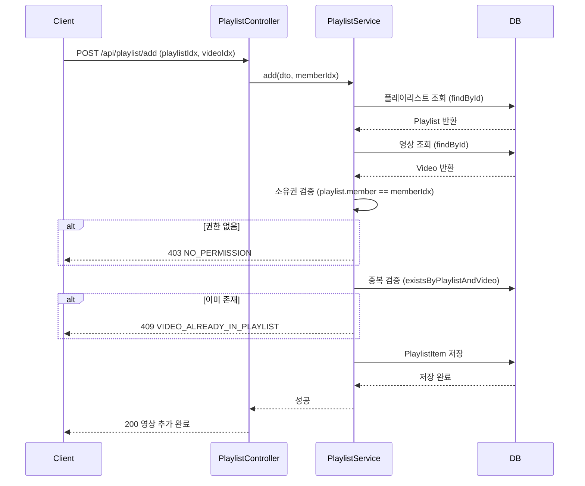
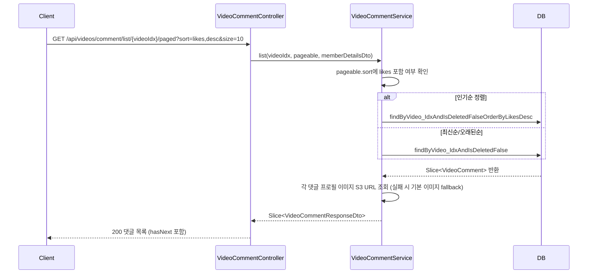

<h1 align="center">Dabom(FlowBox)  </h1>

 
 

프로젝트명 '다봄' 은 **'다'** 같이 **'본다'** 는 동시 시청의 핵심 기능과 새로운 디지털 공동체 문화가
**'봄'** 처럼 새롭게 시작된다는 의미를 동시에 담고 있습니다.

## 🫂 팀원 소개
<table align="center">
  <tbody>
    <tr>
      <td align="center"><a href="https://github.com/raccoon-coding"> <b> 팀원: 최민성</b></a> </td>
      <td align="center"><a href="https://github.com/tipsyboy"> <b> 팀원: 양형모</b></a> </td>
      <td align="center"><a href="https://github.com/flionme"> <b> 팀원 : 김성인</b></a> </td>
      <td align="center"><a href="https://github.com/Hanryang-Kim"> <b> 팀원 : 김륜환</b></a> </td>
      <td align="center"><a href="https://github.com/kbw07"> <b> 팀원 : 강병욱 </b></a> </td>
    </tr>
  </tbody>
</table>

---
# 🎬  Streaming Service

## 🎯 프로젝트 소개
**"혼자 보는 영상에서 함께하는 경험으로"**

비대면 소통이 일상화된 시대에, 단순한 영상 시청을 넘어 **실시간 공유와 소통이 가능한 스트리밍 서비스**를 개발하고자 합니다.
영상 콘텐츠와 실시간 채팅, 동시 시청 기능을 결합하여 새로운 형태의 디지털 공동체 경험을 제공하는 것이 저희의 목표입니다.

---
## 💚 Front-end
<a href="https://www.dabom.net">프론트 주소</a>
##  📜소프트웨어 아키텍처
<a href="https://github.com/beyond-sw-camp/be17-3rd-FlowBox-DaBom/wiki/%EC%86%8C%ED%94%84%ED%8A%B8%EC%9B%A8%EC%96%B4-%EC%95%84%ED%82%A4%ED%85%8D%EC%B3%90">소프트웨어 아키텍쳐</a>

## 🔧시스템 아키텍처
<a href="https://github.com/beyond-sw-camp/be17-3rd-FlowBox-DaBom/wiki/%EC%8B%9C%EC%8A%A4%ED%85%9C-%EC%95%84%ED%82%A4%ED%85%8D%EC%B3%90">시스템 아키텍쳐</a>

## 📝 기능 명세서
<a href="https://api.dabomvideo.kro.kr/swagger-ui/index.html"> 기능 명세서 - Swagger-ui </a>

## 💡 성능 개선
<a href="https://github.com/beyond-sw-camp/be17-3rd-FlowBox-DaBom/wiki/%EC%84%B1%EB%8A%A5-%EA%B0%9C%EC%84%A0"> 테스트 및 성능 개선 </a>

---

### 핵심 기여 (담당 도메인 중심)
**플레이리스트 (Playlist)**
- 플레이리스트 CRUD 및 영상 추가/중복 방지 구현
- 모든 작업에 **소유권 검증**을 적용해 타인의 플레이리스트 접근 차단
- `PlaylistItem` 연관 엔티티로 영상-플레이리스트 관계 분리 관리

**영상 댓글 (VideoComment)**
- 댓글 등록/수정/소프트 삭제 및 **최신순·오래된순·인기순** 정렬 조회 구현
- **Slice 기반 페이지네이션**으로 무한 스크롤 방식 응답 최적화
- 좋아요 연동(`Likes` 엔티티)으로 인기순 정렬 및 카운트 증감 처리

### 성과
- 소유권 검증 일원화로 **권한 누락 없는 접근 제어** 달성
- Slice 페이지네이션으로 **불필요한 COUNT 쿼리 제거** 및 응답 최적화
- 소프트 삭제 적용으로 **댓글 데이터 무결성** 유지

---
# 🌱 제가 담당한 핵심 개발 영역 (Backend)

## 1️⃣ Playlist 도메인
- 플레이리스트 생성/목록 조회/상세 조회/제목 수정/삭제
- 플레이리스트에 영상 추가 (중복 여부 `existsByPlaylistAndVideo` 로 사전 검증)
- 모든 작업에 소유권 검증 적용 (본인 플레이리스트만 수정·삭제·조회 가능)
- 삭제 시 연관 `PlaylistItem` 일괄 삭제 처리

### ✔ 해결한 문제
- 동일 영상 중복 추가 시도 → `existsByPlaylistAndVideo` 로 **409 Conflict** 사전 차단
- 타인의 플레이리스트 접근 → 소유권 검증 후 **권한 없음 예외** 발생

---

## 2️⃣ VideoComment(영상 댓글) 도메인
- 댓글 등록/수정/소프트 삭제 (`isDeleted = true` 방식)
- 댓글 목록 **Slice 기반 페이지네이션** (최신순·오래된순·인기순 정렬 선택)
- `Likes` 엔티티와 연동한 좋아요 카운트 증감 처리
- 댓글 작성자 프로필 이미지 S3 URL 연동 (조회 실패 시 기본 이미지 fallback)

### ✔ 해결한 문제
- 대용량 댓글 목록 응답 → **Slice 페이징**으로 COUNT 쿼리 없이 무한 스크롤 구현
- 삭제된 댓글 노출 방지 → `findByVideo_IdxAndIsDeletedFalse` 로 **소프트 삭제 필터링**

---

## 🧩 Playlist 영상 추가 흐름

```mermaid
sequenceDiagram
    participant Client
    participant API as PlaylistController
    participant Svc as PlaylistService
    participant DB

    Client->>API: POST /api/playlist/add (playlistIdx, videoIdx)
    API->>Svc: add(dto, memberIdx)
    Svc->>DB: 플레이리스트 조회 (findById)
    DB-->>Svc: Playlist 반환
    Svc->>DB: 영상 조회 (findById)
    DB-->>Svc: Video 반환
    Svc->>Svc: 소유권 검증 (playlist.member == memberIdx)
    alt 권한 없음
        Svc-->>Client: 403 NO_PERMISSION
    end
    Svc->>DB: 중복 검증 (existsByPlaylistAndVideo)
    alt 이미 존재
        Svc-->>Client: 409 VIDEO_ALREADY_IN_PLAYLIST
    end
    Svc->>DB: PlaylistItem 저장
    DB-->>Svc: 저장 완료
    Svc-->>API: 성공
    API-->>Client: 200 영상 추가 완료
```

---

## 🧩 VideoComment 댓글 조회 흐름 (정렬 + 페이지네이션)

```mermaid
sequenceDiagram
    participant Client
    participant API as VideoCommentController
    participant Svc as VideoCommentService
    participant DB

    Client->>API: GET /api/videos/comment/list/{videoIdx}/paged?sort=likes,desc&size=10
    API->>Svc: list(videoIdx, pageable, memberDetailsDto)
    Svc->>Svc: pageable.sort에 likes 포함 여부 확인
    alt 인기순 정렬
        Svc->>DB: findByVideo_IdxAndIsDeletedFalseOrderByLikesDesc
    else 최신순/오래된순
        Svc->>DB: findByVideo_IdxAndIsDeletedFalse
    end
    DB-->>Svc: Slice<VideoComment> 반환
    Svc->>Svc: 각 댓글 프로필 이미지 S3 URL 조회 (실패 시 기본 이미지 fallback)
    Svc-->>API: Slice<VideoCommentResponseDto>
    API-->>Client: 200 댓글 목록 (hasNext 포함)
```

---

## 🛠 기술 스택
### ✔️ Back-end

### ✔️ DB

### ✔️ Infra

---

# 👋 문의 또는 코드 리뷰 환영합니다!